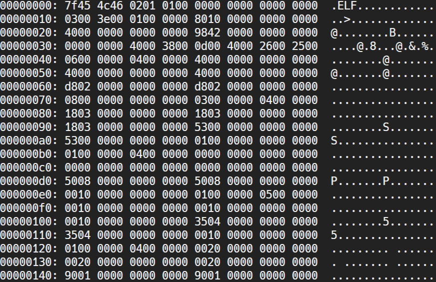

# Arbeitsbericht vom 15.04.2026

- Name:      Philipp Rossmaier
- Klasse:    2AHITS
- Gruppe:    2
- Fach:      ITSI Übungen
- Thema:     Disassemblieren
---

## 1) Basic befehle
``` 
### GNU Debugger (gdb) ###

b main              # set a breakpoint at function main
run                 # start the program from the beginning
disas               # disassemble the current function
disas main          # disassemble the function main
display/i $pc       # show current instruction at every step

x/i 0xabcd          # show the instruction at address 0xabcd
x/5i 0xabcd         # show 5 instructions starting at address 0xabcd
x/16xb 0x401000     # show 16 bytes of data at address 0x401000 in hex

c                # continue program execution
s                # execute the next instruction and step into functions
n                # execute the next line but step over function calls
si               # step into assembler instruction
ni               # step over assembler instruction

info registers eflags # show flags

# set memory
set {unsigned char}0x401000 = 0x90
``` 
## 2) Aufgaben 

# Aufgabe 1
Download:

REPLIT: neues REPL mit Framework/bash anlegen – Download: pwcheck für REPLIT
Ausführbar machen mit:

$ chmod +x pwcheck

starte das Programm mit

$ ./pwcheck

## Lösung
man downloadet das file drag and droppt es ins replit und fürt dann angegebene befehle aus.

# Aufgabe 2
Manche Files, z.B. compilierte Programme, sind Binärdaten. Diese enthalten alle möglichen Bytewerte nicht nur die gültigen ASCII Codes. Eine Anzeige mit cat ist daher nicht zielführend. Der Inhalt von Binärfiles wird als Hexdump angezeigt. Dies kann mit dem Tool xxd gemacht werden. Ein Hexdump zeigt üblicherweise 3 Spalten an: Offset, Hexcodes der Daten und ASCII Darstellung der Daten. Probiere:

xxd pwcheck

bzw.

xxd pwcheck | more

Wenn die Datei eine Linux Programmdatei ist, dann kann auch mit objdump mehr über den Inhalt herausgefunden werden.

## Lösung
Nach dem du denn befehl ausfürst kommt etwa so etwas raus:


# Aufgabe 3:
In diesem Schritt analysieren wir gemeinsam das Programm um einen Weg zu finden die Passwortabfrage zu umgehen.

Zuerst betreiben wir Reverse Engineering, dies bedeutet, eine bestehende Software zu analysieren, um zu verstehen, wie sie funktioniert.

Wenn wir verstanden haben was das Programm tut und wie dessen binäre Struktur aussieht ändern wir das Programm im Speicher bevor es ausgeführt wird.

Wie verwenden für diesen Schritt den GNU Debugger (gdb). Mit einem Debugger kann man einem Programm live bei der Ausführung zusehen und dieses kontrollieren.

Cheat Sheet für die gdb Befehle:

### GNU Debugger (gdb) ###

b main              # set a breakpoint at function main
run                 # start the program from the beginning
disas               # disassemble the current function
disas main          # disassemble the function main
display/i $pc       # show current instruction at every step

x/i 0xabcd          # show the instruction at address 0xabcd
x/5i 0xabcd         # show 5 instructions starting at address 0xabcd
x/16xb 0x401000     # show 16 bytes of data at address 0x401000 in hex

c                # continue program execution
s                # execute the next instruction and step into functions
n                # execute the next line but step over function calls
si               # step into assembler instruction
ni               # step over assembler instruction

info registers eflags # show flags

# set memory
set {unsigned char}0x401000 = 0x90


x86-64 REGISTER OVERVIEW

GENERAL PURPOSE (64 bit)
RAX RBX RCX RDX
RSI RDI RBP RSP

SUBREGISTERS (example RAX)
RAX (64)
EAX (32)
AX  (16)
AL  (8 low)
AH  (8 high, only AX/BX/CX/DX)

Wiederhole und dokumentiere den ganzen Vorgang von der Analyse des Programms im gdb bis zur Manipulation der if-Anweisung.

## Lösung:
- mann startet gdb mit ```gdb pwcheck```
- einen break point bei main setzten mit ```b main```
- programm starten ```run```
- mit ```disas```die password abfrage finden(et {unsigned char}0x000055caad1551c8 = 0x90)
- ```x/i $pc``` eingeben und die gesuchte stelle finden.
- man ändert den befehl von jump if equal zu nichts mit:```(gdb) set {unsigned char}0x000055caad1551c8 = 0x90
(gdb) set {unsigned char}0x000055caad1551c9 = 0x90
(gdb) set {unsigned char}0x000055caad1551ca = 0x90
(gdb) set {unsigned char}0x000055caad1551cb = 0x90
(gdb) set {unsigned char}0x000055caad1551cc = 0x90
(gdb) set {unsigned char}0x000055caad1551cd = 0x90```

# Aufgabe 3
Übung (Binary File Patching I)
Die Änderungen lassen sich auch permanent im Binärfile des Programms durchführen. Dazu analysiert man mit objdump -d pwcheck die Programmdatei um herauszufinden auf welchem Offset sich die zu manipulierenden Daten befinden.

Suche in der Ausgabe nach main

0000000000001170 <main>:
    1170:       48 81 ec 98 00 00 00    sub    $0x98,%rsp
    1177:       64 48 8b 04 25 28 00    mov    %fs:0x28,%rax
    117e:       00 00 
    1180:       48 89 84 24 90 00 00    mov    %rax,0x90(%rsp)
    1187:       00 
    1188:       c7 44 24 04 00 00 00    movl   $0x0,0x4(%rsp)
    118f:       00 
    1190:       48 8d 3d 7d 0e 00 00    lea    0xe7d(%rip),%rdi        # 2014 <_IO_stdin_used+0x14>
    1197:       b0 00                   mov    $0x0,%al
    1199:       e8 92 fe ff ff          call   1030 <printf@plt>
    119e:       48 8d 74 24 50          lea    0x50(%rsp),%rsi
    11a3:       48 8d 3d 7b 0e 00 00    lea    0xe7b(%rip),%rdi        # 2025 <_IO_stdin_used+0x25>
    11aa:       b0 00                   mov    $0x0,%al
    11ac:       e8 af fe ff ff          call   1060 <__isoc23_scanf@plt>
    11b1:       48 8d 05 58 2e 00 00    lea    0x2e58(%rip),%rax        # 4010 <expected>
    11b8:       48 8b 38                mov    (%rax),%rdi
    11bb:       48 8d 74 24 50          lea    0x50(%rsp),%rsi
    11c0:       e8 db 00 00 00          call   12a0 <_Z14check_passwordPKcS0_>
    11c5:       83 f8 00                cmp    $0x0,%eax
    11c8:       0f 84 95 00 00 00       je     1263 <main+0xf3>
    11ce:       48 8d 3d 55 0e 00 00    lea    0xe55(%rip),%rdi        # 202a <_IO_stdin_used+0x2a>
    11d5:       b0 00                   mov    $0x0,%al
    11d7:       e8 54 fe ff ff          call   1030 <printf@plt>
    11dc:       48 8d 05 2d 2e 00 00    lea    0x2e2d(%rip),%rax        # 4010 <expected>
    11e3:       48 8b 38                mov    (%rax),%rdi
    11e6:       48 8d 74 24 10          lea    0x10(%rsp),%rsi
    11eb:       e8 80 01 00 00          call   1370 <_Z12rot13_stringPKcPc>
    11f0:       48 8d 74 24 10          lea    0x10(%rsp),%rsi
    11f5:       48 8d 3d 37 0e 00 00    lea    0xe37(%rip),%rdi        # 2033 <_IO_stdin_used+0x33>
    11fc:       b0 00                   mov    $0x0,%al
    11fe:       e8 2d fe ff ff          call   1030 <printf@plt>
    1203:       48 8d 3d 3b 0e 00 00    lea    0xe3b(%rip),%rdi        # 2045 <_IO_stdin_used+0x45>
    120a:       b0 00                   mov    $0x0,%al
    120c:       e8 1f fe ff ff          call   1030 <printf@plt>
    1211:       48 8d 3d 30 0e 00 00    lea    0xe30(%rip),%rdi        # 2048 <_IO_stdin_used+0x48>
    1218:       48 8d 74 24 0c          lea    0xc(%rsp),%rsi
    121d:       b0 00                   mov    $0x0,%al

Hier ist die zu manipulierende Stelle:

    11c8:       0f 84 95 00 00 00       je     1263 <main+0xf3>

Dabei ist 11c8 der hexadezimale Offset vom Beginn der Datei. An dieser Stelle steht der Maschinensprachebefehl je. Conditional Jump if Equal. Wir überschreiben diesen 6 Byte langen Befehl mit nop’s. Ein nop (no operation) ist ein 1 Byte großer Befehl (0x90). Achtung: je kann unterschiedliche Längen haben, je nach dem wie weit das Sprungziel weg ist – hier sind es 6 Bytes.

Diese Manipulation von Daten nennt man “patchen” (engl. “to patch”).

Fürs patchen das Tool hexeditor verwenden:

hexedit pwcheck

Ctrl+G (goto)
Offset in Hex eingeben
Bytes überschreiben mit 90
Ctrl+X (save and exit)
und testen.

Was ist das Passwort?

## Lösung
G7pL9xQ2mR4tZcH


